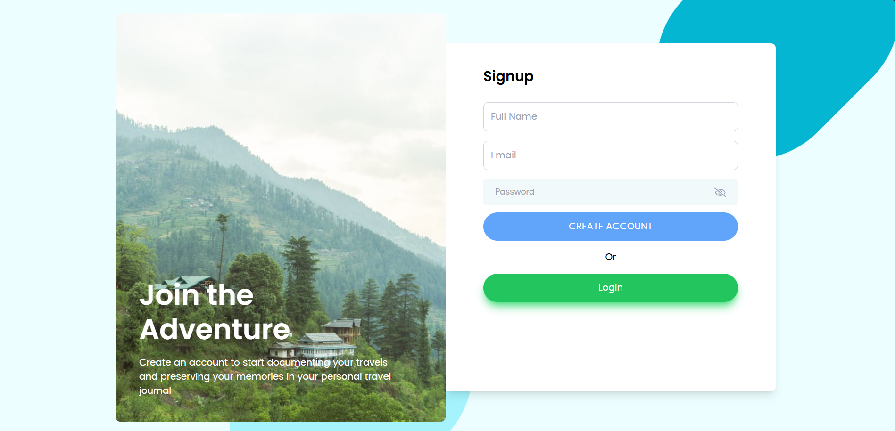
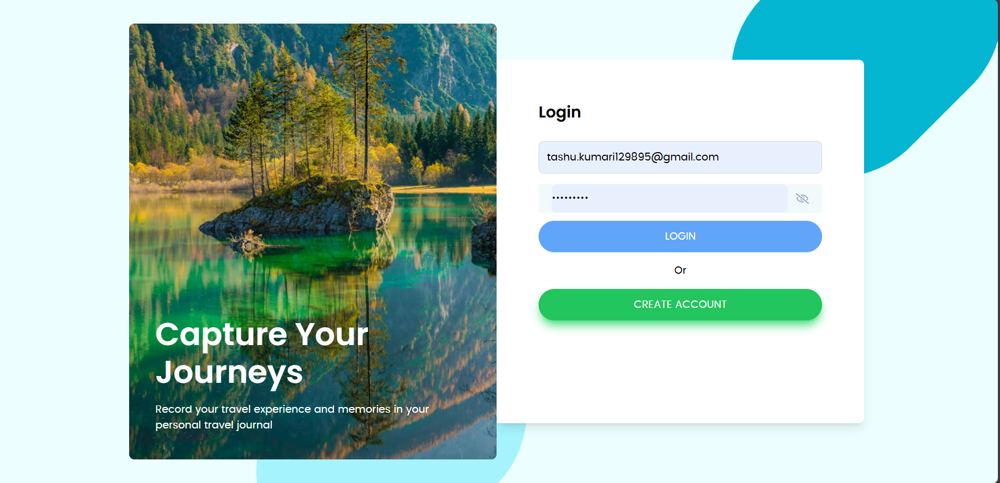
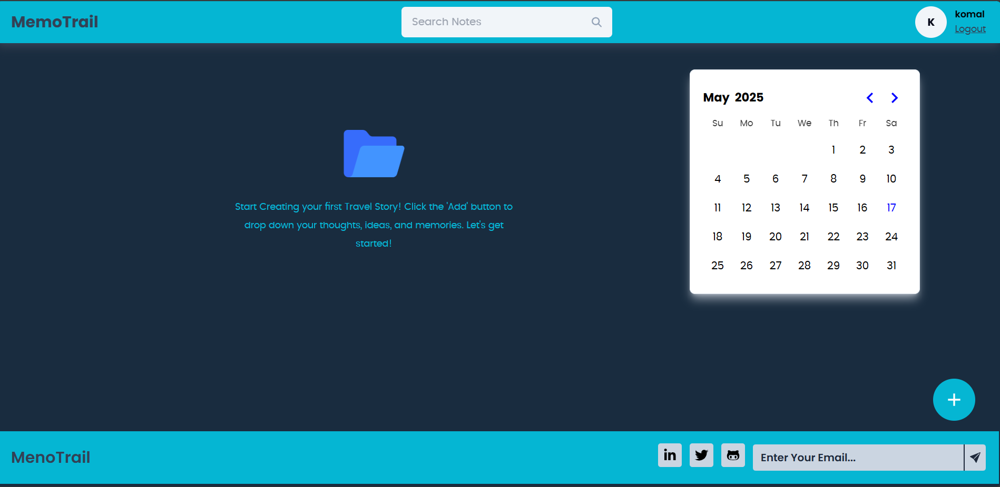
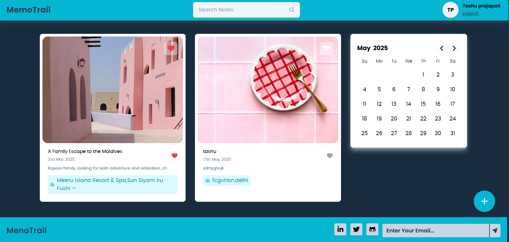
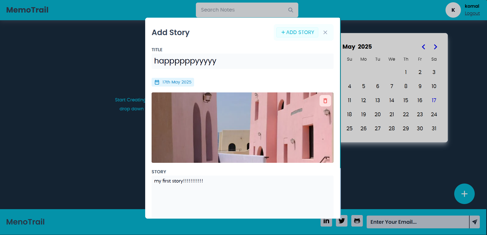
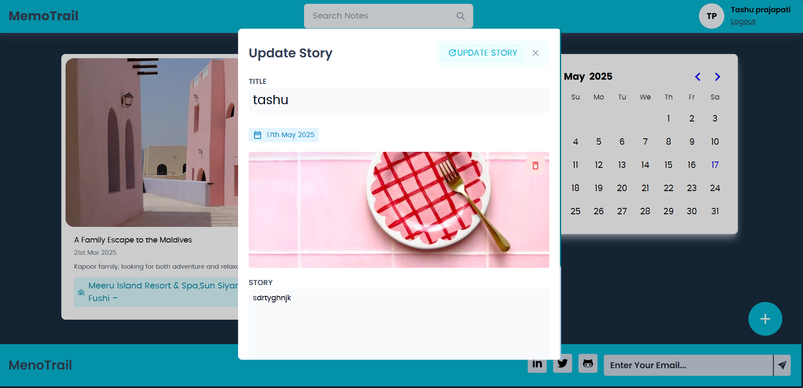
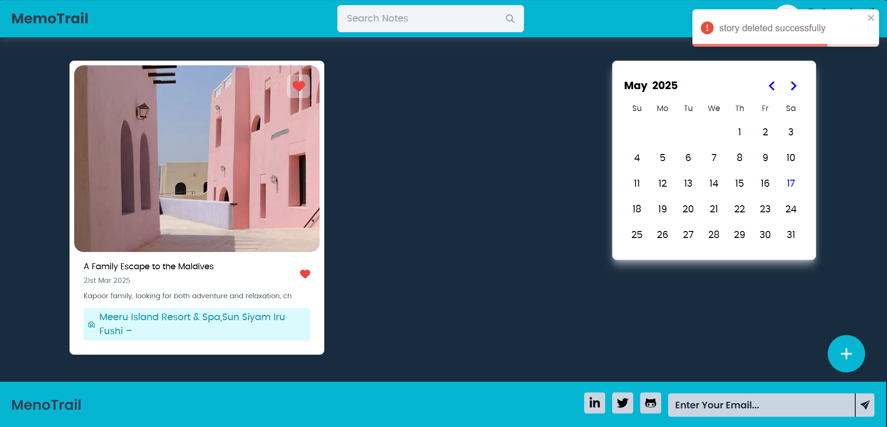
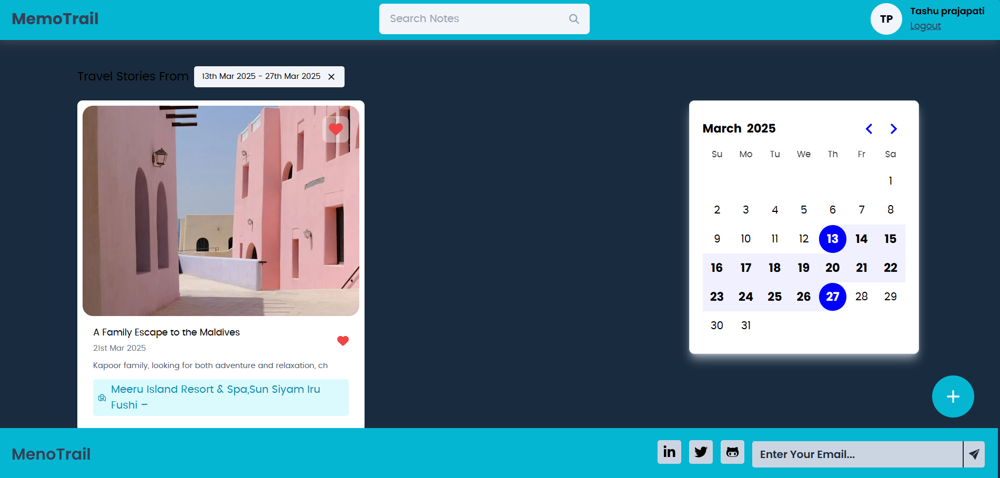
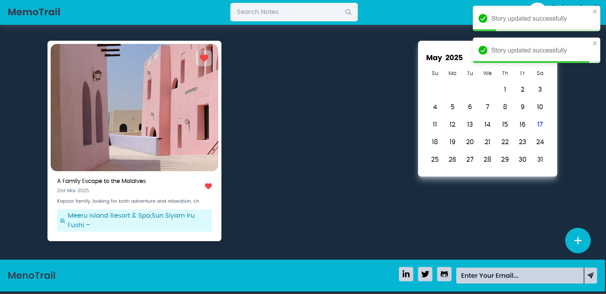

# 🌍 Travel Story App

The **Travel Story App** is a full-stack web application that enables users to **capture, manage, and share their travel experiences** with others. Users can write detailed stories including **locations, images, dates**, and **descriptions** of their journeys. It's a digital diary for travel lovers, designed with a clean UI and secure login system.

---

## 📖 Overview

Traveling is all about creating memories — this app helps users preserve those memories in a visual and interactive format. Once logged in, users can create travel stories, upload photos, and record details about their trips, such as **where they went**, **when they visited**, and **what they experienced**. 

The application follows modern web development practices and features a mobile-friendly interface. It is built using the **MERN stack** (MongoDB, Express, React, Node.js) and supports **JWT-based authentication** to protect user data.

---

## 🚀 Live Demo

- **Frontend (React + Vercel)**: [Open Frontend](https://your-frontend-url.vercel.app)
- **Backend (Express + MongoDB + Render)**: [Open Backend](https://your-backend-url.onrender.com)

> ⚠️ You must be logged in to create, edit, or delete a story.

---
Key Features:
User Authentication:

Secure user registration and login using JWT.
Protected routes for authenticated users.
Travel Story Management:

Add Story: Users can create new travel stories with details like title, location, description, and images.
Edit Story: Users can update their existing stories.
Delete Story: Users can remove stories they no longer want to keep.
View Stories: A collection of all travel stories created by the user.
Responsive Design:

Built with TailwindCSS for a clean, modern, and mobile-friendly UI.
Backend API:

RESTful API built with Node.js and Express.js.
Database management using MongoDB for storing user data and travel stories.
Development Tools:

VS Code: Primary code editor for development.
Postman: For testing API endpoints during development.
React + Vite: Frontend framework for fast and efficient development.
Advantages for Users:

A digital space to preserve travel memories.
Easy-to-use interface for managing stories.
Secure and private storage of personal travel experiences.

## 🧱 Tech Stack

### 🔹 Frontend
- React.js
- React Router DOM
- Axios
- Tailwind CSS (or your preferred CSS framework)
- JWT-based auth
- Hosted on **Vercel**

### 🔹 Backend
- Node.js
- Express.js
- MongoDB with Mongoose
- JWT Authentication
- CORS, Helmet for security
- Hosted on **Render**

---
Description:
🚀 Excited to Share My Latest Project: Travel Story Platform! 🌍

I’m thrilled to announce the completion of my Travel Story Platform, a web application built using the MERN stack (MongoDB, Express.js, React, and Node.js). This platform allows travelers to document, edit, and share their travel memories in a secure and user-friendly environment.

✨ Key Features:

Add, edit, and delete travel stories.
Secure user authentication with JWT.
Modern and responsive UI designed with TailwindCSS.
Built with React + Vite for a fast and efficient frontend experience.
🔧 Tools Used:

VS Code for development.
Postman for API testing.
MongoDB for database management.
🌟 Why This Project? Traveling creates unforgettable memories, and this platform provides a digital space for users to preserve and relive those moments. Whether it’s a weekend getaway or a global adventure, every story deserves to be told!

Check out the project on GitHub (link to your repository) and let me know your thoughts! 💬

#MERNStack #React #Vite #TailwindCSS #JWT #WebDevelopment #TravelStories #Coding #FullStackDevelopment #VS Code #Postman

## website Features :

